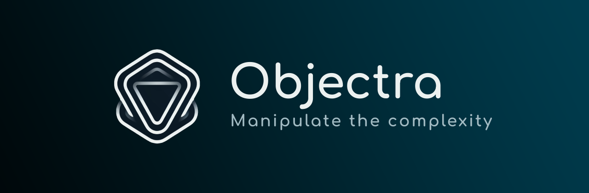

# Objectra



## Introduction

Objectra is a powerful and comprehensive TypeScript library designed for object transformation, serialization, and metadata management. With its class-based architecture, it allows for extensible and customizable handling of object-related operations.

> [!WARNING]
> The documentation in this Markdown file pertains to a software implementation that is currently under development. Some information, including the package name (currently 'objectra', future '@objectra/core'), may change upon publication. All documentation, including this README and its links, will be fully applicable and accurate once the package is officially released.

## **Features**

- **Object Container**: Utilize static methods to create Objectra instances for deep cloning, serialization, and more.
- **Serialization and Deserialization**: Take advantage of Transformator for custom serialization and deserialization logic.
- **Metadata Management**: Efficiently manage object references and metadata.
- **Custom Transformation Logic**: Define custom transformation rules using various decorators.
- **Extensible**: Highly customizable to fit your project's specific needs.

## **Installation**

To install Objectra, simply run:

```bash
npm install @objectra/core
```

## **Usage**

### **Objectra**

> [!NOTE]
> Objectra instances are created via static methods, not with **`new Objectra()`**.

Here's how to perform basic object operations:

```tsx
import { Objectra } from "@objectra/core";

const obj = Objectra.from({ key: "value" });
const duplicate = obj.duplicate();
```

### **Transformator**

Register a class and register it for Objectra transformations:

```tsx
import { Transformator } from "@objectra/core";

@Transformator.Register()
class MyClass {
  // class definition
}
```

### **Decorators**

- **`@Register`**: Register a class for transformation.
- **`@InvertFromMapping`**: Specify a transformation exception for a property.
- **`@Include`**: Include a property in transformations.
- **`@Exclude`**: Exclude a property from transformations.
- **`@ConstructorArgument`**: Pass through arguments during instantiation.

## **API Documentation**

For a comprehensive API reference, please consult the [official documentation](https://www.notion.so/Objectra-Documentation-94a20c91ef404cd69c9cf8f87f2c9142?pvs=21).

## **Contributing**

If you're interested in contributing to Objectra, please read the **CONTRIBUTING.md** file.

## **License**

Objectra is licensed under the MIT License. For more details, see the **LICENSE.md** file.

## **Contact**

For any inquiries, you can contact the author via email at [vadym.iefremov@gmail.com](mailto:vadym.iefremov@gmail.com).